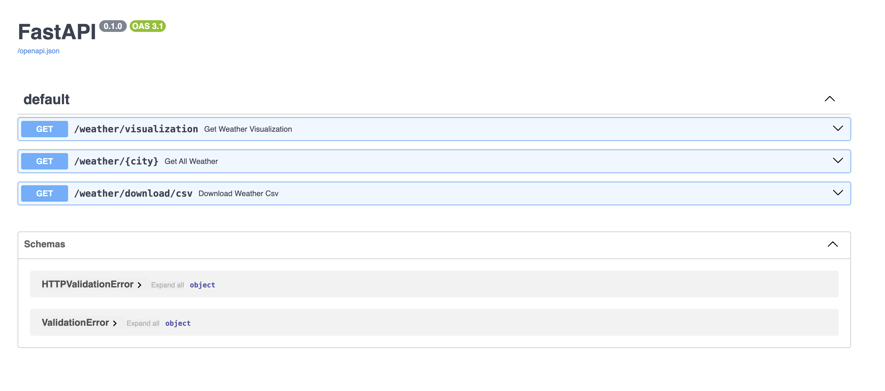
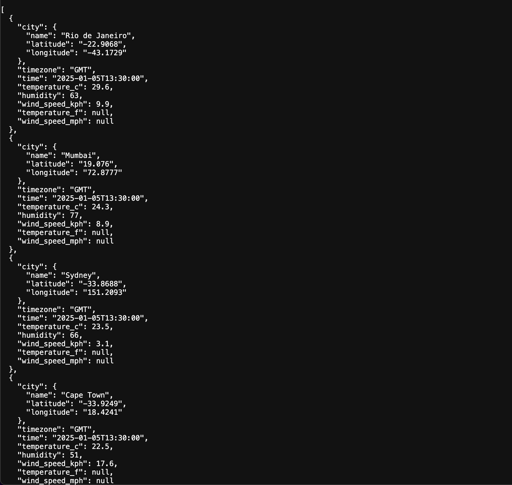
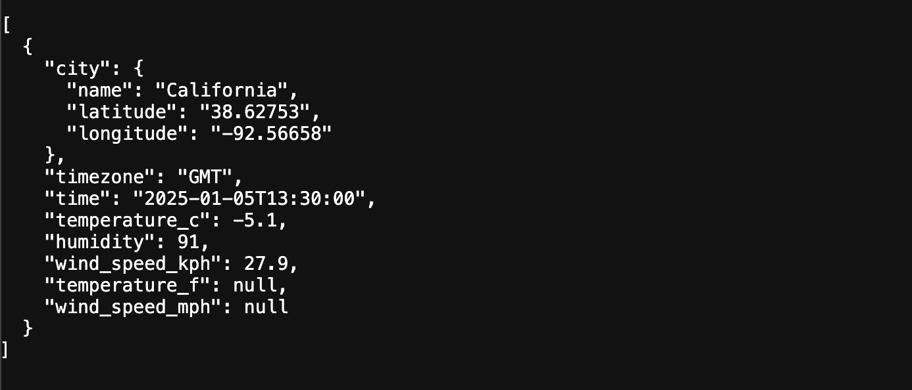
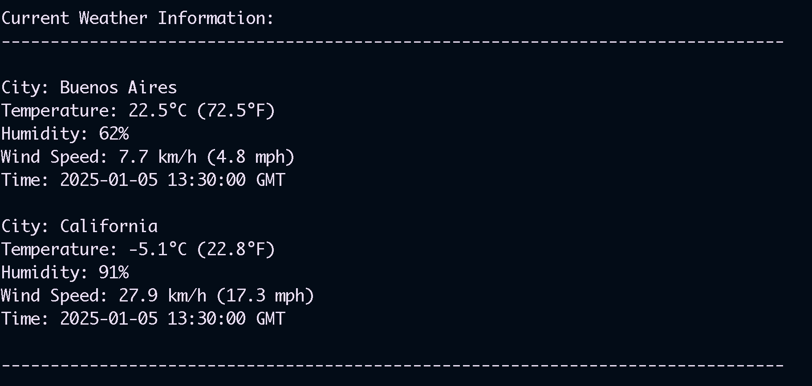

# Weather Data Application

A Python application for fetching and visualizing weather data across multiple cities. The project includes both a CLI tool and a REST API for accessing weather information.

## Features

- Fetch real-time weather data for predefined or custom cities
- Generate visualizations of temperature, humidity, and wind speed
- Export weather data to CSV format
- REST API endpoints for programmatic access
- Docker support for containerized deployment

## Prerequisites

- Python 3.12+
- Docker (optional)
- Make (optional, for using Makefile commands)

## Directories

The project has the following directory structure:

- `api/` - FastAPI application code and endpoints
- `data/` - Storage for weather data CSV files
- `scripts/` - CLI application code and utilities
- `static/` - Static files to serve in this documentation file
- `tests/` - Test files organized by module
- `weather_app/` - Core weather service functionality and models

## Installation

1. Clone the repository:

   ```bash
   git clone https://github.com/yourusername/weather-app.git
   cd weather-app
   ```

2. Set up Python environment and install dependencies:

   ```bash
   make setup
   ```

   Or manually:

   ```bash
   pip install uv
   uv venv
   uv sync
   ```

3. Run cli tool to generate csv

   ```bash
   make run-cli
   ```

4. Optional: Build and run with Docker:

   ```bash
   make docker-build
   make docker-run
   ```

5. Run directly in your shell

   ```bash
   make run-api
   ```

6. Run tests to ensure everything is working:
   ```bash
   make test
   ```

## Using the CLI Tool

The CLI tool allows you to fetch weather data for cities and save it to a CSV file. You can run it in two modes:

1. Using predefined cities from constants:

   ```bash
   make run-cli
   ```

   This will fetch weather data for all predefined cities.

2. Specifying custom cities and using the geocoding API:
   ```bash
   python -m scripts.weather.main --use-api --city "London" --city "Paris" --city "Tokyo"
   ```

The tool supports the following options:

- `--use-api`: Use the geocoding API to fetch city coordinates instead of predefined constants
- `--city` or `-c`: Specify one or more cities to fetch weather data for (can be used multiple times)

The weather data will be saved to `data/weather_data.csv` and can be used by the API server or downloaded directly.

The script will also save a csv with the Top 5 Cities ranked by temperature and another with all cities ranked by wind speed.

## API Endpoints

The API server provides the following endpoints:

### 1. Get Weather Visualization

- **URL:** `/weather/visualization`
- **Method:** `GET`
- **Description:** Generate visualization plots for weather data showing temperature, humidity and wind speed by city.
- **Returns:** A PNG image containing the visualization plots.

### 2. Get Weather Data

- **URL:** `/weather/{city}`
- **Method:** `GET`
- **Description:** Get weather data for a single city or all predefined cities.
- **Parameters:**
  - `city`: City name or "all" to get data for all predefined cities.
  - `sort_by`: Optional parameter to sort results by temperature or wind speed.
- **Returns:** A list of Weather objects containing weather data.

### 3. Download Weather CSV

- **URL:** `/weather/download/csv`
- **Method:** `GET`
- **Description:** Download the weather data as a CSV file.
- **Returns:** A CSV file containing weather data.

### 4. API Documentation

- **URL:** `/docs`
- **Method:** `GET`
- **Description:** API documentation using Swagger UI.
- **Returns:** Interactive API documentation.

## Screenshots

### API Documentation



### API Weather Sorted by Descending Temperature



### API California Weather



### CLI Buenos Aires and California Weather

```bash
python -m scripts.weather.main -c "Buenos Aires" -c California
```



## Pending Improvements

- Use asynchronous package to make the API calls to improve performance and reduce idle time.
- Add logging capabilities
- Add more unit tests. Add functional and E2E tests
- As the API grows, we should separate routers from business logic
